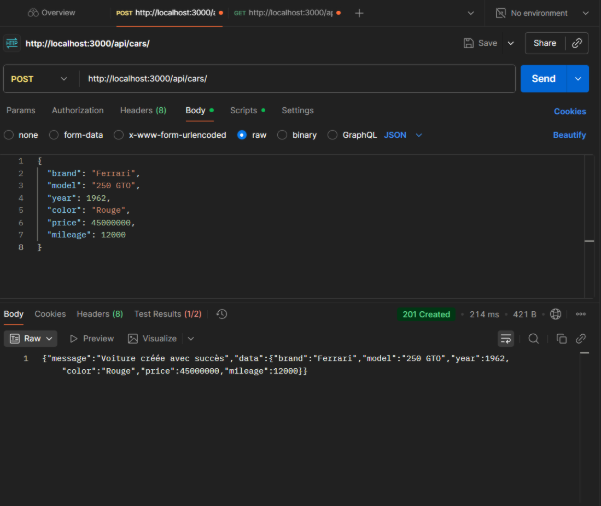
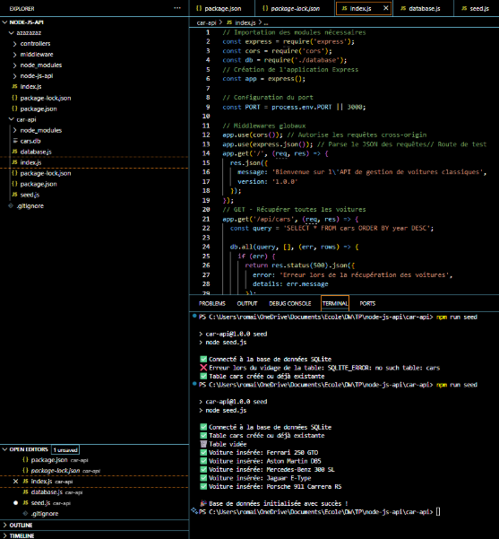
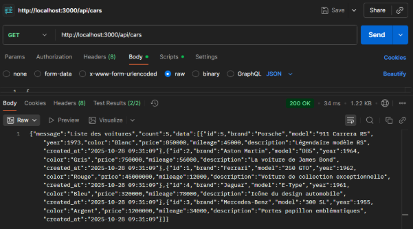
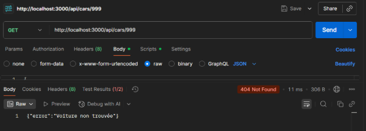
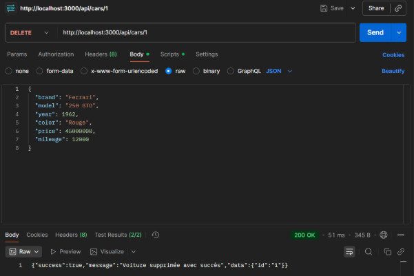
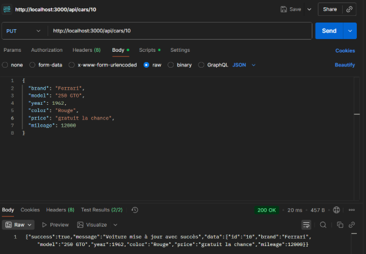
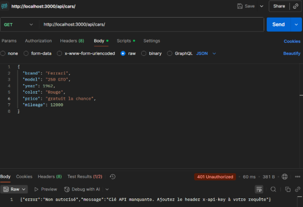
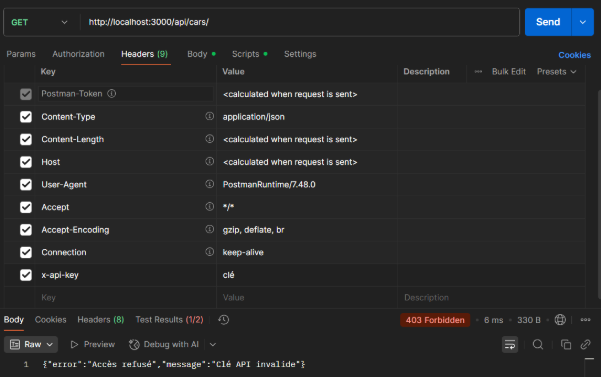
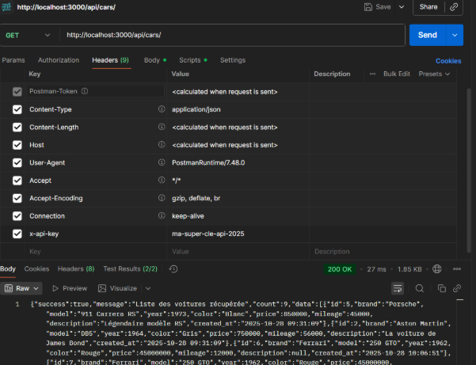
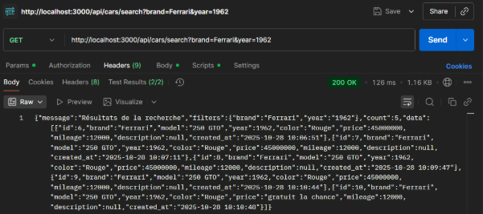

|
CHOUQUET Romain

PIEDELEU Robin
|||
| :- | :-: | -: |

TP développement web

Séance 1 : Initialisation du projet et première route

Initialisation de l’API node.js

Dans cette première étape, on met en place la base du serveur Node.js avec Express.\
` `L’objectif est d’obtenir une API simple capable de répondre à des requêtes HTTP de type GET, POST, PUT et DELETE.\
` `On initialise également les middlewares essentiels (cors et express.json) pour gérer la communication entre le backend et un futur frontend.

|
// Importation des modules nécessaires

const express = require('express');

const cors = require('cors');

// Création de l'application Express

const app = express();

// Configuration du port

const PORT = process.env.PORT || 3000;

// Middlewares globaux

app.use(cors()); // Autorise les requêtes cross-origin

app.use(express.json()); // Parse le JSON des requêtes// Route de test

app.get('/', (req, res) => {

`  `res.json({ 

`    `message: 'Bienvenue sur l\'API de gestion de voitures classiques',

`    `version: '1.0.0'

`  `});

});

// GET - Récupérer toutes les voitures

app.get('/api/cars', (req, res) => {

`  `res.json({ 

`    `message: 'Liste de toutes les voitures',

`    `data: [] 

`  `});

});

// GET - Récupérer une voiture par son ID

app.get('/api/cars/:id', (req, res) => {

`  `const id = req.params.id;

`  `res.json({ 

`    `message: `Voiture avec l'ID ${id}`,

`    `data: null 

`  `});

});

|
// POST - Créer une nouvelle voiture

app.post('/api/cars', (req, res) => {

`  `const carData = req.body;

`  `res.status(201).json({ 

`    `message: 'Voiture créée avec succès',

`    `data: carData 

`  `});

});

// PUT - Modifier une voiture existante

app.put('/api/cars/:id', (req, res) => {

`  `const id = req.params.id;

`  `const carData = req.body;

`  `res.json({ 

`    `message: `Voiture ${id} modifiée`,

`    `data: carData 

`  `});

});

// DELETE - Supprimer une voiture

app.delete('/api/cars/:id', (req, res) => {

`  `const id = req.params.id;

`  `res.json({ 

`    `message: `Voiture ${id} supprimée` 

`  `});

});

// Démarrage du serveur

app.listen(PORT, () => {

`  `console.log(`🚀 Serveur démarré sur le port ${PORT}`);

`  `console.log(`📍 [http://localhost:${PORT}`]());

});

app.get('/api/cars', (req, res) => {

  

`  `res.json({ message: 'Liste des voitures' });

});

|
| :- | :- |

On ajoute avec la méthode “POST” un élément à la base de données

Ce premier serveur est purement statique. Les données ne sont pas encore stockées : chaque requête retourne un message JSON fixe.\
` `Cette étape permet de comprendre la structure d’une API REST et de vérifier que les routes fonctionnent dans Postman.

Séance 2 : Base de données SQLite

Dans cette étape, on connecte notre API à une base de données SQLite, afin de rendre les routes dynamiques.\
` `SQLite permet d’écrit des requêtes SQL (SELECT, INSERT, UPDATE, DELETE) directement dans les routes Express.

|
// Importation des modules nécessaires

const express = require('express');

const cors = require('cors');

const db = require('./database');

// Création de l'application Express

const app = express();

// Configuration du port

const PORT = process.env.PORT || 3000;

// Middlewares globaux

app.use(cors()); // Autorise les requêtes cross-origin

app.use(express.json()); // Parse le JSON des requêtes// Route de test

app.get('/', (req, res) => {

`  `res.json({ 

`    `message: 'Bienvenue sur l\'API de gestion de voitures classiques',

`    `version: '1.0.0'

`  `});

});

// GET - Récupérer toutes les voitures

app.get('/api/cars', (req, res) => {

`  `const query = 'SELECT \* FROM cars ORDER BY year DESC';

  

`  `db.all(query, [], (err, rows) => {

`    `if (err) {

`      `return res.status(500).json({ 

`        `error: 'Erreur lors de la récupération des voitures',

`        `details: err.message 

`      `});

`    `}

    

`    `res.json({

`      `message: 'Liste des voitures',

`      `count: rows.length,

`      `data: rows

`    `});

`  `});

});

// GET - Récupérer une voiture par son ID

app.get('/api/cars/:id', (req, res) => {

`  `const id = req.params.id;

`  `const query = 'SELECT \* FROM cars WHERE id = ?';

|
`  `db.get(query, [id], (err, row) => {

`    `if (err) {

`      `return res.status(500).json({ 

`        `error: 'Erreur serveur',

`        `details: err.message 

`      `});

`    `}

    

`    `if (!row) {

`      `return res.status(404).json({ 

`        `error: 'Voiture non trouvée' 

`      `});

`    `}

`    `res.json({

`      `message: 'Voiture trouvée',

`      `data: row

`    `});

`  `});

});

// POST - Créer une nouvelle voiture

app.post('/api/cars', (req, res) => {

`  `const carData = req.body;

`  `res.status(201).json({ 

`    `message: 'Voiture créée avec succès',

`    `data: carData 

`  `});

});

// PUT - Modifier une voiture existante

app.put('/api/cars/:id', (req, res) => {

`  `const id = req.params.id;

`  `const carData = req.body;

`  `res.json({ 

`    `message: `Voiture ${id} modifiée`,

`    `data: carData 

`  `});

});

// DELETE - Supprimer une voiture

app.delete('/api/cars/:id', (req, res) => {

`  `const id = req.params.id;

`  `res.json({ 

`    `message: `Voiture ${id} supprimée` 

`  `});

});

// Démarrage du serveur

app.listen(PORT, () => {

`  `console.log(`🚀 Serveur démarré sur le port ${PORT}`);

`  `console.log(`📍 [http://localhost:${PORT}`]());

});

app.get('/api/cars', (req, res) => {

  

`  `res.json({ message: 'Liste des voitures' });

});

|
| :- | :- |

**Explication du schéma de table :**

- INTEGER PRIMARY KEY AUTOINCREMENT : ID unique qui s'incrémente automatiquement
- TEXT NOT NULL : Champ texte obligatoire
- INTEGER : Nombre entier
- REAL : Nombre décimal
- DATETIME DEFAULT CURRENT\_TIMESTAMP : Date de création automatique

La base de données a bien été ajoutée on vérifie avec POSTMAN la recherche dans la base de données

On affiche ainsi toute la base

Le 1er élément

On recherche hors des limites de la base de données

Séance 3 : Contrôleurs et architecture MVC

Dans cette étape, on sépare le code en plusieurs fichiers :

- **controllers/** pour la logique métier (interactions avec la base)
- **models/** pour la gestion des données (SQL)
- **app.js** pour la configuration principale du serveur

Cela améliore la lisibilité, la maintenabilité et permet de faire évoluer le projet plus facilement.

Séance 4 : 

Pour sécuriser l’accès à notre API, on met en place un **middleware** vérifiant une clé API dans les headers de chaque requête.\
` `Sans cette clé, l’accès est refusé.

|
const express = require('express');

const bodyParser = require('body-parser');

const cors = require('cors');

const carsController = require('./controllers/usersControllers');

const app = express();

const PORT = process.env.PORT || 3000;

const checkApiKey = require('./middleware/checkApiKey');

// Middlewares

app.use(cors());

app.use(bodyParser.json());

// Route de bienvenue

app.get('/', (req, res) => {

`  `res.json({ 

`    `message: 'Bienvenue sur l\'API de gestion de voitures classiques',

`    `version: '1.0.0',

`    `endpoints: {

`      `getAllCars: 'GET /api/cars',

`      `getCarById: 'GET /api/cars/:id',

`      `createCar: 'POST /api/cars',

`      `updateCar: 'PUT /api/cars/:id',

`      `deleteCar: 'DELETE /api/cars/:id'

`    `}

`  `});

});

// Routes CRUD (protégées par le middleware)

app.get('/api/cars', checkApiKey, carsController.getAllCars);

app.get('/api/cars/:id', checkApiKey, carsController.getCarById);

app.post('/api/cars', checkApiKey, carsController.createCar);

app.put('/api/cars/:id', checkApiKey, carsController.updateCar);

app.delete('/api/cars/:id', checkApiKey, carsController.deleteCar);

// Gestion des routes non trouvées

app.use((req, res) => {

`  `res.status(404).json({ 

`    `error: 'Route non trouvée',

`    `message: `La route ${req.method} ${req.url} n'existe pas` 

`  `});

});

// Démarrage du serveur

app.listen(PORT, () => {

`  `console.log(`🚀 Serveur démarré sur le port ${PORT}`);

`  `console.log(`📍 [http://localhost:${PORT}`]());

});

|
| :- |

|
// Middleware pour vérifier la clé API

const checkApiKey = (req, res, next) => {

`  `// Récupérer la clé API depuis les headers

`  `const apiKey = req.headers['x-api-key'];

  

`  `// Clé API attendue (en production, stockez-la dans des variables d'environnement)

`  `const validApiKey = 'ma-super-cle-api-2025';

  

`  `// Vérification

`  `if (!apiKey) {

`    `return res.status(401).json({

`      `error: 'Non autorisé',

`      `message: 'Clé API manquante. Ajoutez le header x-api-key à votre requête'

`    `});

`  `}

  

`  `if (apiKey !== validApiKey) {

`    `return res.status(403).json({

`      `error: 'Accès refusé',

`      `message: 'Clé API invalide'

`    `});

`  `}

  

`  `// Si tout est OK, on passe au prochain middleware/route

`  `console.log('✅ Clé API valide');

`  `next();

};

module.exports = checkApiKey;

|
| :- |

J'ai mis “clé” au lieu de “ma-super-cle-api-2025" donc ça ne peut pas fonctionner

Plus loin : 

Affiche permet d'effectuer une recherche dans la base de données on voie les différents essais que j’ai fait d'ajout de la Ferrari

||||
| :- | :-: | -: |

